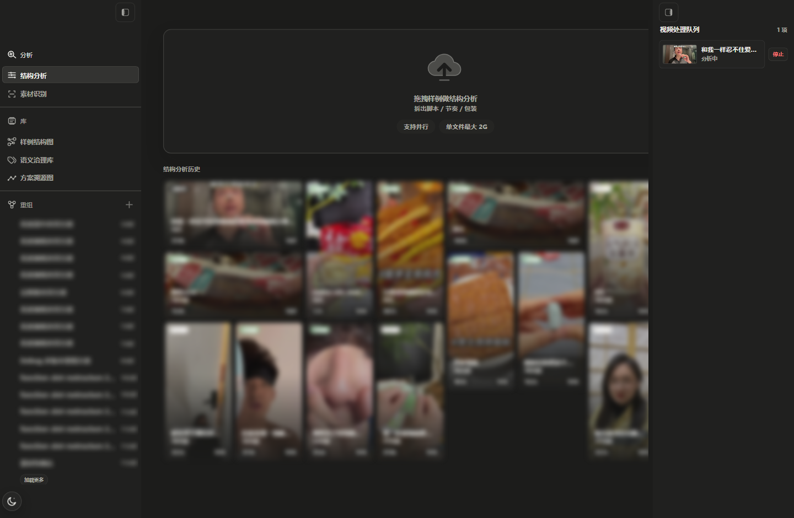
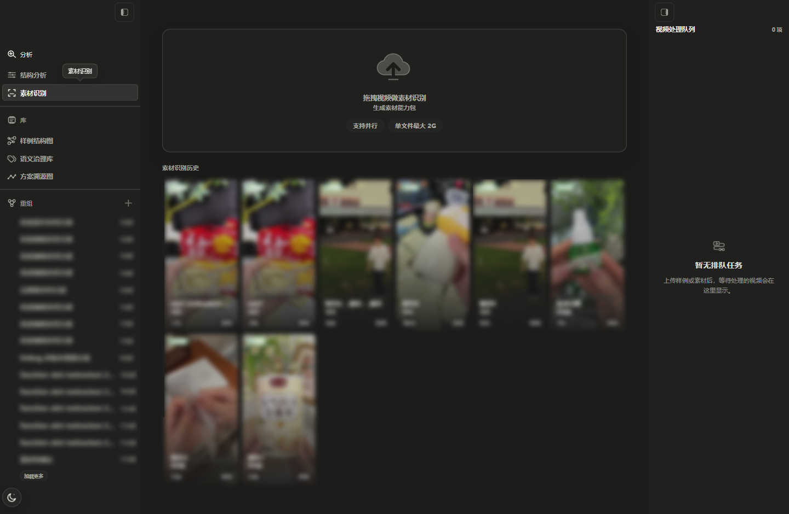
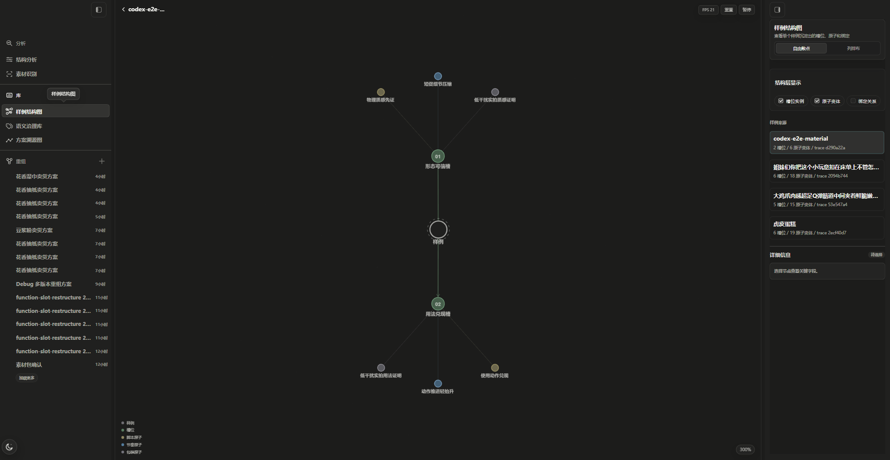
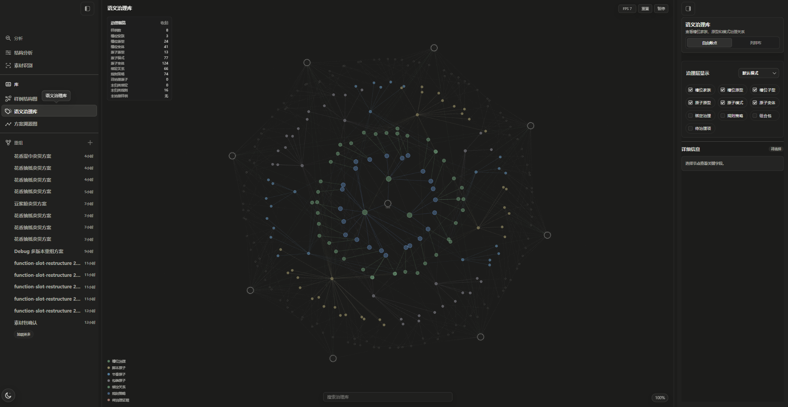
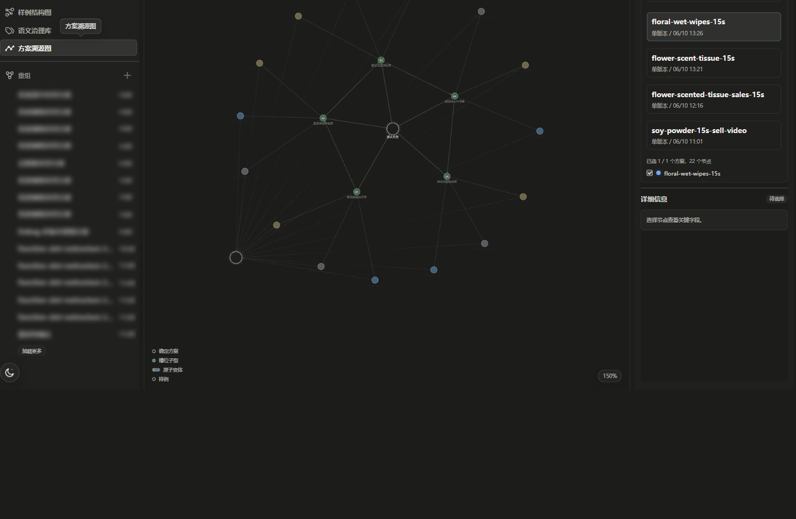
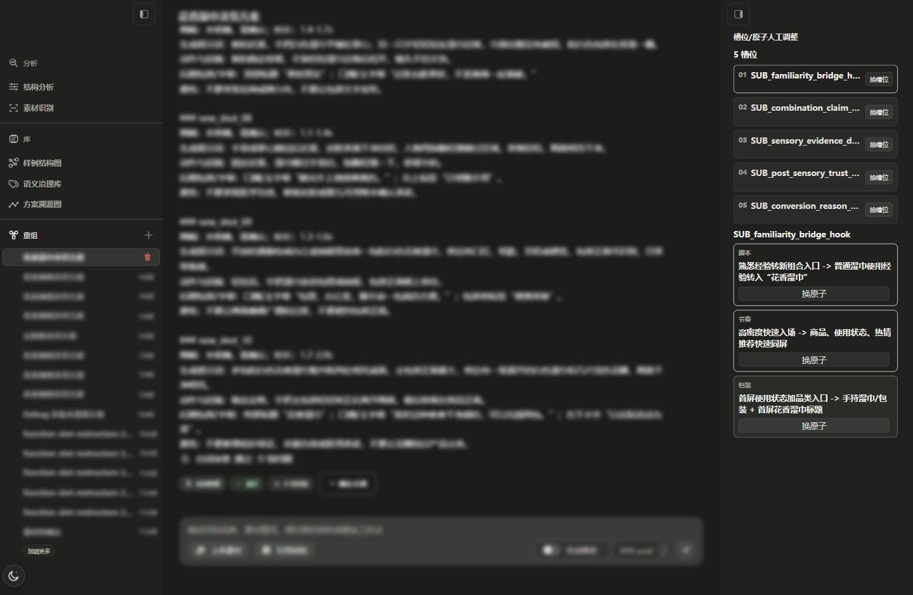
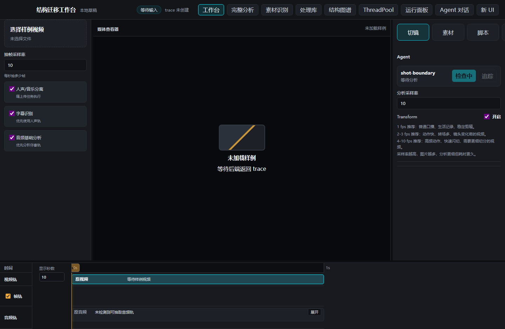

# 爆款结构迁移引擎

这是一个面向短视频创作的本地 AI 工作台。它不直接生成成片，而是把优质样例拆成可迁移的脚本、节奏、包装和功能槽位结构，再迁移到新的商品、主题或用户素材上。

日常使用请从新 UI 进入；旧 UI 只作为兼容入口保留。

## 快速开始

环境要求：

- Windows PowerShell
- Node.js 18+
- Python 3.10+
- 本机可执行 `codex` CLI
- Python 依赖：`pydantic`、`websocket-client`、`fastapi`、`uvicorn`

首次准备依赖：

```powershell
npm install
python -m pip install pydantic websocket-client fastapi uvicorn
```

然后填写唯一需要手动改的配置文件：

```text
Config\app.config.jsonc
```

启动完整本地栈：

```bat
start-api-server.bat
```

脚本会启动 Codex AppServer、ThreadPool、API server 和新 UI 开发服务器。启动完成后浏览器会自动打开新 UI：

```text
http://127.0.0.1:5178/
```

保持启动窗口打开即可使用；按 `Esc` 或 `Ctrl+C` 会停止这一组本地服务。

## 配置说明

所有普通使用配置都放在 `Config\app.config.jsonc`。通常只需要改下面四块。

`imageGeneration` 用于 Storyboard 生图。可以填 OpenAI 官方接口，也可以填 pptoken 或任何兼容 OpenAI 图片接口的代理。使用 OpenAI 时保持 `provider: "openai"`，把 `apiKey` 换成自己的 OpenAI key，并使用 `https://api.openai.com/v1/images/generations` / `https://api.openai.com/v1/images/edits`。使用 pptoken 或代理时，把 `provider`、`apiKey`、`generationsUrl`、`editsUrl` 换成对应服务提供的值。

`subtitleRecognition` 用于豆包 SAUC 字幕识别，这是主流程必填能力。请填写真实的 `appKey` 和 `accessKey`，`resourceId` 默认使用 `volc.bigasr.sauc.duration`，除非豆包控制台给了不同资源。

`media.ffmpegBinDir` 建议指向仓库内置 ffmpeg：

```text
C:\ByteDanceFullStack\ffmpeg-8.1.1-full_build-shared\bin
```

这样可以避免不同机器上的 ffmpeg 版本差异影响切镜、抽帧、音频特征和字幕处理。

`shotBoundary.rawAnalysisWorkspaceRoot` 指向一个项目外部的 Codex workspace。`video-shot` skill 会从这个路径自动解析：

```text
<rawAnalysisWorkspaceRoot>\.agents\skills\video-shot\SKILL.md
```

建议把 `video-shot` 放在外部 workspace，而不是放进本项目目录。这样原始切镜分析只读取专门的分析工作区，不会误扫本仓库里的业务代码和大量运行产物。

## 新 UI 使用

打开 `http://127.0.0.1:5178/` 后，左侧是新 UI 的主导航。

- `分析`：上传样例视频或用户素材，执行结构分析、素材识别等前置处理。
- `库`：查看样例结构图、语义治理库和方案溯源图。
- `重组`：基于样例结构和用户素材，让 Agent 生成、返工或确认重组方案，并继续进入分镜 / Storyboard 流程。

推荐流程是：先在 `分析` 中处理样例和素材，再到 `重组` 创建方案；需要查看结构来源或治理结果时，再切到 `库`。

以下截图来自本地运行的新 UI，历史记录内容已做模糊处理；实际使用时会显示你自己的样例、素材和重组会话。

结构分析入口用于上传样例视频，拆出脚本、节奏和包装结构。



素材识别入口用于上传用户素材，生成后续重组和分镜可消费的素材能力包。



`库` 下面有三个图谱入口，分别服务于不同层级的结构查看和追踪。

`样例结构图` 查看单个样例沉淀出的槽位、脚本原子、节奏原子、包装原子和绑定关系。它适合用来回答“这个样例到底拆出了什么结构”，也可以从分析结果回跳到对应样例。



`语义治理库` 查看跨样例沉淀后的 slot subtype、原子模式、绑定治理和规则治理。它适合用来判断多个样例之间哪些结构可以归并，哪些命名或证据关系需要治理。



`方案溯源图` 查看已确认重组方案如何连接到样例、槽位、原子和最终确定方案。它适合用来追踪“这个重组方案从哪些结构证据来”，也方便复盘和返工。



重组区用于选择已有会话、继续对话、替换槽位原子，并确认方案进入后续 Storyboard 流程。



## 切换旧 UI

新 UI 左上角有 `旧 UI` 切换按钮。也可以直接访问：

```text
http://127.0.0.1:5178/workspace
```

回到新 UI 可访问：

```text
http://127.0.0.1:5178/
```

旧 UI 仍保留工作台、完整分析、素材识别、处理库、结构图谱、ThreadPool、运行面板和 Agent 对话等兼容入口。



## 常见问题

端口占用：启动脚本默认使用 `5178` 作为新 UI、`5177` 作为 API、`8146` 作为 Codex AppServer、`8877` 作为 ThreadPool。如果启动失败并提示端口被占用，先关闭之前打开的启动窗口，或结束占用这些端口的旧进程后重新运行 `start-api-server.bat`。

配置未生效：确认修改的是 `Config\app.config.jsonc`，保存后重新运行 `start-api-server.bat`。
